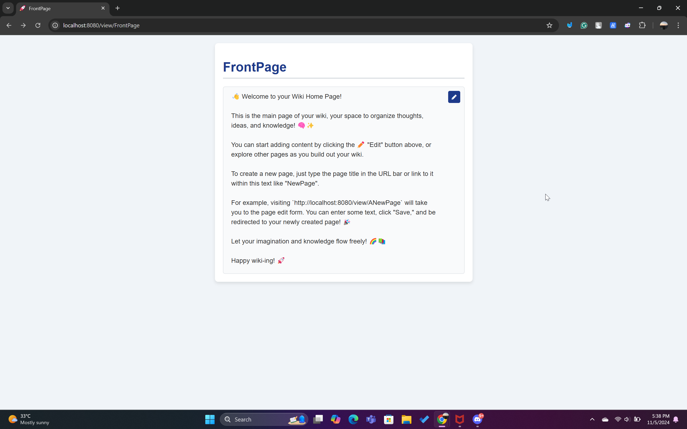
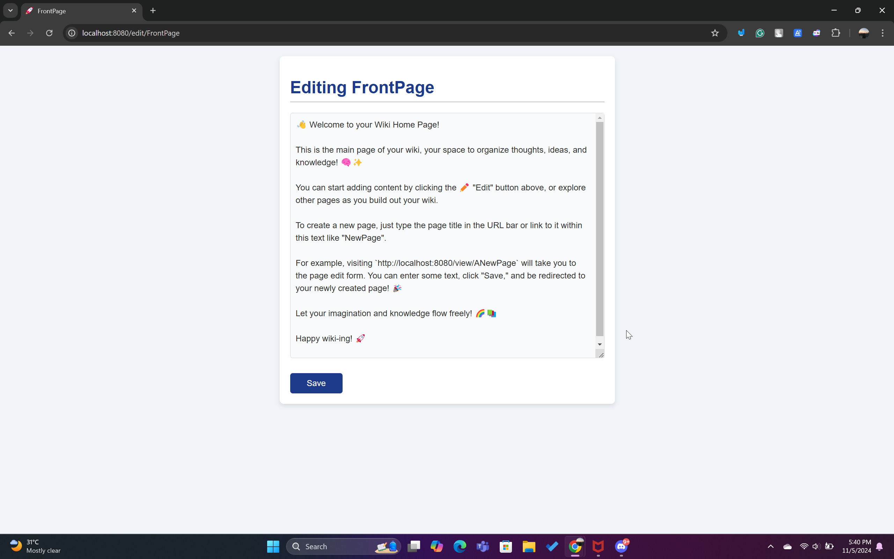
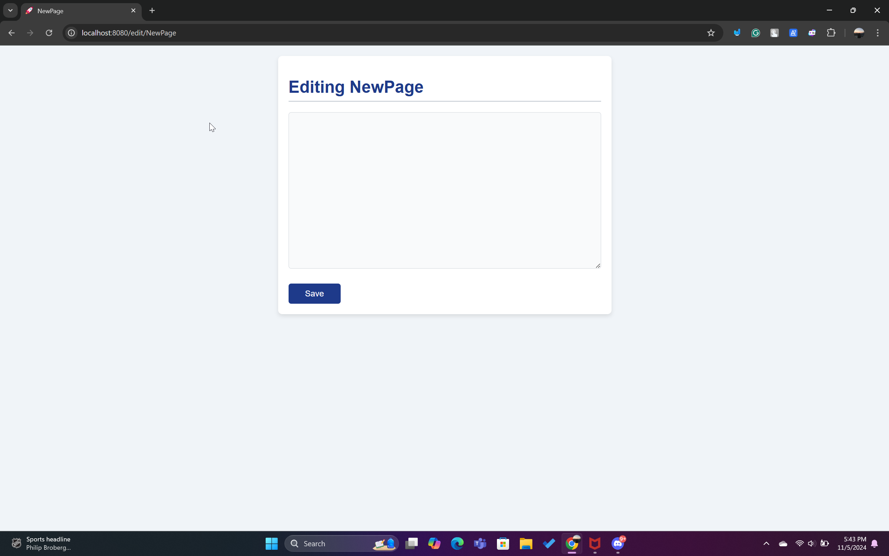
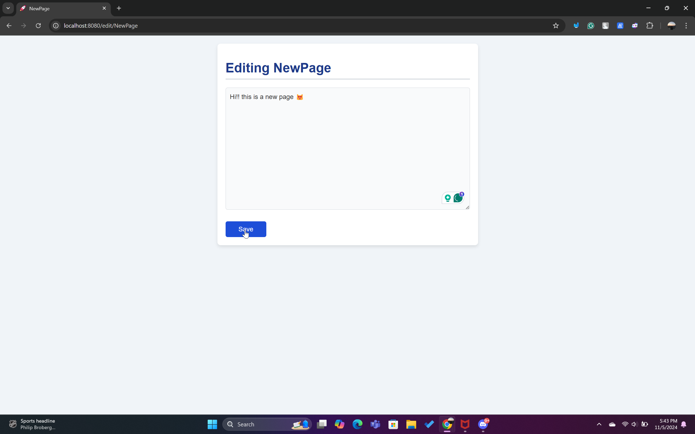
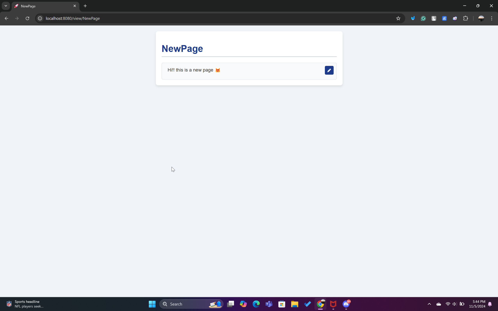

# Go Wiki Web Application

This Go project is part of my course, **Pemrograman Berbasis Kerangka Kerja (D)**. It is inspired by the [Writing Web Applications tutorial](https://go.dev/doc/articles/wiki/) from the official Go documentation. This repository will be continuously updated as I follow tutorials and expand on foundational concepts for building web applications in Go.

## ⭐ Identity

- **Name:** Rayssa Ravelia  
- **NRP:** 5025211219  
- **Class:** Pemrograman Berbasis Kerangka Kerja (D)


## ⭐ Project Overview

This project is a simple wiki-style web application built with Go. It allows users to create, view, and edit pages in the form of text files, which are stored on the server. The application serves as a learning project to apply and deepen my understanding of Go for web development.

### Key Features
- **Dynamic Page Creation**: Users can visit a URL for a new page and start editing immediately.
- **Edit and Save Functionality**: Users can click on an "Edit" button to modify existing pages and save their changes.
- **Persistent Storage**: Page data is saved in the `data/` folder as `.txt` files, making each page’s content accessible and editable.
- **User Interface**: Custom styling with an improved button and text field UI, and an added favicon.


## ⭐ File Structure

The file structure for this project is organized as follows:

```
GO-WEB-APPLICATION/          # Main project directory
│
├── gowiki/                  # Contains the main Go wiki application files
│   ├── data/                # Stores the page data in .txt files
│   │   ├── ANewPage.txt
│   │   ├── FrontPage.txt
│   │   └── NewPage.txt
│   │
│   ├── tmpl/                # Stores HTML templates and CSS for rendering pages
│   │   ├── edit.html
│   │   ├── view.html
│   │   └── style.css        # CSS file for styling the application
│   │
│   ├── go.mod               # Go module file
│   ├── wiki.go              # Main application logic
│   └── TestPage.txt         # Sample page data file
│
├── img/                     # Contains screenshots of the application views for the README
│   ├── front-page-view.png
│   ├── front-page-edit.png
│   ├── new-page.png
│   ├── new-page-edit.png
│   └── new-page-view.png
│
└── README.md                # Documentation file for project overview
```

### Explanation of Structure

- **`gowiki/`**: This directory contains the core files for the Go Wiki application.
  - **`data/`**: Stores the content of each wiki page in separate `.txt` files, allowing persistence across sessions.
  - **`tmpl/`**: Holds HTML templates (`edit.html` and `view.html`) to render the application's user interface. It also includes `style.css` for styling. Although styles are served as static files, keeping them in `tmpl/` alongside templates organizes related UI components in one place.
  - **`go.mod`**: Go module file that manages dependencies.
  - **`wiki.go`**: Main Go file containing the application’s logic, including routing, page handling, and template rendering.
  - **`TestPage.txt`**: An additional sample text file for testing purposes.

- **`img/`**: Contains screenshots of the application views, which are referenced in the README for visual explanation.

- **`README.md`**: This documentation file for the project, including setup instructions, file structure, and usage examples.


## ⭐ How to Run This Repo

To get started with this Go Wiki application, follow these steps:

1. **Ensure Go is installed**:
   - Make sure you have Go installed on your system. If you haven't installed it yet, download it from the official Go website: [https://go.dev/dl/](https://go.dev/dl/).

2. **Clone the repository**:
   - Clone this repo to your local machine using the following command:
     ```bash
     git clone git@github.com:rayrednet/Go-Web-Application.git
     ```

3. **Navigate to the project directory**:
   - Change to the `gowiki` directory:
     ```bash
     cd Go-Web-Application/gowiki
     ```

4. **Run the application**:
   - Start the application with:
     ```bash
     go run wiki.go
     ```
   - This will start a server, and you should see output like:
     ```
     Starting server on http://localhost:8080
     ```

5. **Explore the application**:
   - Open your web browser and go to [http://localhost:8080](http://localhost:8080).
   - From there, you can explore the wiki as described in the README. Create new pages, edit existing ones, and view saved content.

And that’s it! You’re ready to use the Go Wiki web application. 🎉


##  ⭐ Screenshots and Application Flow

Below are screenshots showcasing the application and its main features.

### 1. Front Page View



This is the main page of the wiki. It displays the title of the page, a text field showing the page content, and an "Edit" button (with a pencil icon) to modify the page.

### 2. Front Page Edit



To edit the front page, click on the "Edit" button (pencil icon) in the top-right corner. This action redirects you to the edit form where you can make changes to the content. After editing, click "Save" to save your changes.

### 3. Visiting a New Page

If you navigate to a new page, such as by visiting `http://localhost:8080/edit/NewPage`, you’ll see the edit form for this newly created page.



### 4. Editing a New Page

Enter any desired text in the edit form for the new page and click "Save" to save the content.



### 5. Viewing the New Page

After saving, the new page displays the content you just entered. Here’s how it will look:




## ⭐ Summary of the Go Wiki Project

This Go wiki project is inspired by the official Go tutorial, which walks through the basics of building a web application in Go. We created a simple, file-based wiki that lets users create, view, edit, and save pages.

#### Key Components and Features

1. **Page Struct and Data Storage**
   - We defined a `Page` struct to represent a wiki page. This struct has a `Title` and `Body` field to store the page’s title and content.
   - Page content is saved in `.txt` files within the `data/` folder, enabling persistent storage for each page.

   ```go
   type Page struct {
       Title string
       Body  []byte
   }

   func (p *Page) save() error {
       filename := "data/" + p.Title + ".txt"
       return os.WriteFile(filename, p.Body, 0600)
   }
   ```

2. **Load and Save Functions**
   - We created `save` and `loadPage` functions to write and read page data to/from files. The `save` function writes the `Body` to a text file named after the page title, while `loadPage` reads the data back into a `Page` struct.

   ```go
   func loadPage(title string) (*Page, error) {
       filename := "data/" + title + ".txt"
       body, err := os.ReadFile(filename)
       if err != nil {
           return nil, err
       }
       return &Page{Title: title, Body: body}, nil
   }
   ```

3. **Handlers for Viewing and Editing Pages**
   - We set up HTTP handlers to handle different routes in the application. The `viewHandler` displays the page content, while `editHandler` loads the edit form for a page. If a page doesn’t exist, the `editHandler` will create it.

   ```go
   func viewHandler(w http.ResponseWriter, r *http.Request, title string) {
       p, err := loadPage(title)
       if err != nil {
           http.Redirect(w, r, "/edit/"+title, http.StatusFound)
           return
       }
       renderTemplate(w, "view", p)
   }

   func editHandler(w http.ResponseWriter, r *http.Request, title string) {
       p, err := loadPage(title)
       if err != nil {
           p = &Page{Title: title}
       }
       renderTemplate(w, "edit", p)
   }
   ```

4. **Rendering HTML Templates**
   - We created `edit.html` and `view.html` templates in the `tmpl/` directory to render the page views. The templates use Go’s `html/template` package to embed the page data in HTML. For instance, `view.html` displays the page content and an "Edit" button to modify it.

   ```html
   <!-- view.html -->
   <h1>{{.Title}}</h1>
   <div>{{printf "%s" .Body}}</div>
   <a href="/edit/{{.Title}}">Edit</a>
   ```

5. **Adding a Favicon and Improving the UI**
   - We enhanced the interface by adding a favicon, styles in `style.css`, and a friendly message on the FrontPage. The "Edit" button was styled with a pencil icon, and pages display instructions for new users.
   - The favicon was embedded inline as SVG, giving it a unique appearance without needing an external file.

   ```html
   <link rel="icon" href="data:image/svg+xml,<svg xmlns=%22http://www.w3.org/2000/svg%22 viewBox=%2210 0 100 100%22><text y=%22.90em%22 font-size=%2290%22>🚀</text></svg>">
   ```

6. **Static File Handling for Styles**
   - Although `style.css` is stored in the `tmpl` folder along with templates, it is referenced using a `/static/` path in the HTML to create a virtual path for serving static files.
   - The following line in `wiki.go` allows us to serve files from `tmpl` under the `/static/` path:

     ```go
     http.Handle("/static/", http.StripPrefix("/static/", http.FileServer(http.Dir("tmpl"))))
     ```

     - **Explanation**:
       - **`http.Handle("/static/", ...)`**: Maps any URL starting with `/static/` to serve static files.
       - **`http.StripPrefix("/static/", ...)`**: Removes `/static/` from the URL path before looking for files in `tmpl`.
       - **`http.FileServer(http.Dir("tmpl"))`**: Serves files from the `tmpl` directory.
     - **Usage in HTML**:
       - In the HTML templates, the CSS file is referenced as follows:

         ```html
         <link rel="stylesheet" href="/static/style.css">
         ```

     This approach allows us to keep URLs organized and separates static file paths from the folder structure on the server. It is a common pattern in web applications to manage static assets effectively.

7. **Starting the Server**
   - Finally, we set up a main function to start the server on `localhost:8080`, handling requests for viewing and editing pages.

   ```go
   func main() {
       http.HandleFunc("/view/", makeHandler(viewHandler))
       http.HandleFunc("/edit/", makeHandler(editHandler))
       http.HandleFunc("/save/", makeHandler(saveHandler))
       log.Fatal(http.ListenAndServe(":8080", nil))
   }
   ```

## ⭐ Final Thoughts

This project demonstrated the basics of routing, templates, file handling, and building a simple yet functional web application in Go. Through the use of HTTP handlers, templates, and file-based storage, we created a dynamic wiki that saves and displays user content with a clean and user-friendly interface. The virtual path for static files further enhances organization and efficiency.