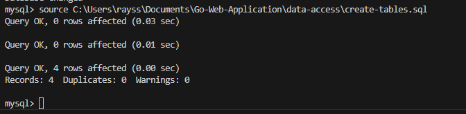
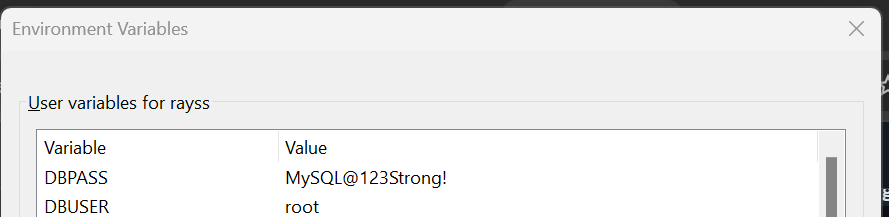
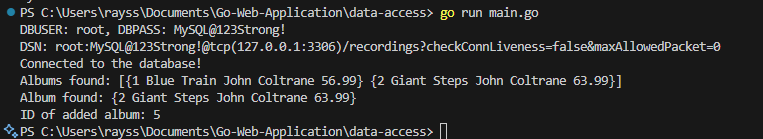

# Accessing Relational Database on Go

## ⭐ Project Overview
This Go project is part of my course, **Pemrograman Berbasis Kerangka Kerja (D)**. It is inspired by the [Tutorial: Accessing a relational database](https://go.dev/doc/tutorial/database-access) from the official Go documentation. The project demonstrates how to connect to a MySQL database, perform CRUD operations, and manage environment variables in Go.

## ⭐ How to Run This Repo

Follow these steps to set up and run the project:

### 1. Ensure Go is Installed
   - Download and install Go from the official website: [https://go.dev/dl/](https://go.dev/dl/).

### 2. Install MySQL
   - Download MySQL Community Edition from: [https://dev.mysql.com/downloads/](https://dev.mysql.com/downloads/).

### 3. Clone the Repository
   - Clone this repo to your local machine:
     ```bash
     git clone git@github.com:rayrednet/Go-Web-Application.git
     ```

### 4. Navigate to the Project Directory
   - Change to the `data-access` directory:
     ```bash
     cd Go-Web-Application/data-access
     ```

### 5. Prepare MySQL Setup and Database

#### a. Login to MySQL
   ```bash
   mysql -u root -p
   ```
   Enter the password you set during MySQL installation.

#### b. Create Database
   ```sql
   CREATE DATABASE recordings;
   USE recordings;
   ```

#### c. Create Tables and Insert Values
   Use the provided `create-tables.sql` script to set up the database schema and populate it with sample data:
   ```sql
   DROP TABLE IF EXISTS album;
   CREATE TABLE album (
       id INT AUTO_INCREMENT NOT NULL,
       title VARCHAR(128) NOT NULL,
       artist VARCHAR(255) NOT NULL,
       price DECIMAL(5,2) NOT NULL,
       PRIMARY KEY (id)
   );

   INSERT INTO album (title, artist, price) VALUES
       ('Blue Train', 'John Coltrane', 56.99),
       ('Giant Steps', 'John Coltrane', 63.99),
       ('Jeru', 'Gerry Mulligan', 17.99),
       ('Sarah Vaughan', 'Sarah Vaughan', 34.98);
   ```

#### d. Run the SQL Script
   Use the `source` command to execute the `create-tables.sql` script:
   ```bash
   mysql> source /path/to/create-tables.sql
   ```
   Verify the output matches the screenshot below:
   

#### e. Set Environment Variables
   Set `DBUSER` and `DBPASS` environment variables by inputting your own database password for the `root` user. For example, if your password is `MySQL@123Strong!`, you can set the environment variables temporarily in your terminal:
   ```bash
   export DBUSER=root
   export DBPASS=MySQL@123Strong!
   ```
   Alternatively, configure them as system-wide variables (refer to the screenshot below):
   

### 6. Run the Application
   - Start the application:
     ```bash
     go run main.go
     ```

## ⭐ Screenshots and Application Flow

### Application Output
After running `main.go`, the output should look like this:



### Code Flow Explanation

#### 1. **Environment Variables**
   - Prints the `DBUSER` and `DBPASS` environment variables to confirm they are set correctly.

#### 2. **Database Connection**
   - Captures MySQL connection properties using the `mysql.Config` struct and connects to the `recordings` database.

#### 3. **Fetch Albums by Artist**
   - Queries the `album` table for albums by a specific artist (e.g., "John Coltrane") and prints the result. This is the output after running `main.go` when fetching albums by the artist:

     ```
     Albums found: [{1 Blue Train John Coltrane 56.99} {2 Giant Steps John Coltrane 63.99}]
     ```

   - This result is obtained from the following code snippet. By providing the artist name `"John Coltrane"`, the query retrieves two entries. Each entry includes the ID of the album, the album name, the selected artist, and the album's price:

        ```go
        // Fetch albums by a specific artist
        albums, err := albumsByArtist("John Coltrane")
        if err != nil {
            log.Fatalf("Error fetching albums: %v", err)
        }
        fmt.Printf("Albums found: %v\n", albums)
        ```

#### 4. **Fetch Album by ID**
   - Retrieves a single album by its ID (e.g., ID 2) and prints the result. This is the output after running `main.go` when fetching an album by ID:

     ```
     Album found: {2 Giant Steps John Coltrane 63.99}
     ```

   - The following code snippet demonstrates how the album is fetched. By providing ID `2`, the function `albumByID(2)` retrieves the album details, including the ID, title, artist, and price, as shown in the output above:

     ```go
     // Fetch an album by ID
     alb, err := albumByID(2)
     if err != nil {
         log.Fatalf("Error fetching album: %v", err)
     }
     fmt.Printf("Album found: %v\n", alb)
     ```

#### 5. **Add New Album**
   - Inserts a new album into the `album` table and prints the new record's ID. The output indicates the ID of the newly created album:
     ```
     ID of added album: 5
     ```
   - This is achieved with the following code snippet. Here, a new album with a `title`, `artist`, and `price` is added to the database, and the resulting ID is printed. Since there are initially 4 entries, the new album gets assigned ID 5:

        ```go
        // Add a new album
        newAlbum := Album{
            Title:  "The Modern Sound of Betty Carter",
            Artist: "Betty Carter",
            Price:  49.99,
        }
        albID, err := addAlbum(newAlbum)
        if err != nil {
            log.Fatalf("Error adding album: %v", err)
        }
        fmt.Printf("ID of added album: %v\n", albID)
        ```

### 🗝️ Key Functions in `main.go`

#### `albumsByArtist(name string) ([]Album, error)`
   - Queries the database for albums by a given artist name.

#### `albumByID(id int64) (Album, error)`
   - Retrieves an album by its unique ID.

#### `addAlbum(alb Album) (int64, error)`
   - Adds a new album to the database and returns the ID of the inserted record.

