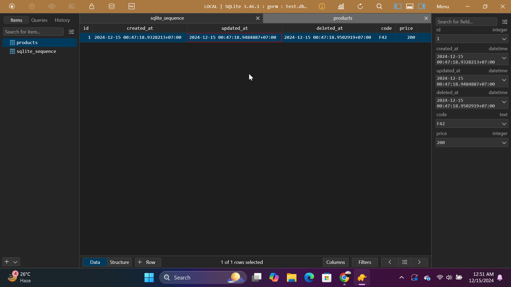
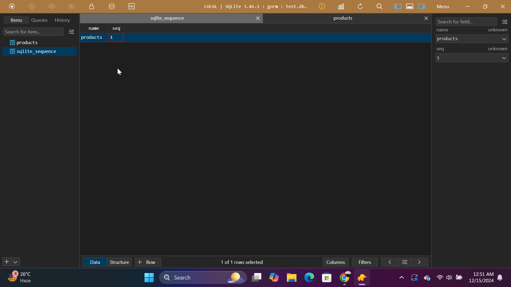

# GORM Guides: Quick Start

## ⭐ Project Overview
This Go project is part of my course, **Pemrograman Berbasis Kerangka Kerja (D)**. It is inspired by the [GORM Guides: Quick Start](https://gorm.io/docs/index.html) from the official GORM documentation. 

**What is GORM?**  
GORM is a powerful Object-Relational Mapper (ORM) library written in Go. It simplifies working with databases by providing an abstraction layer to perform CRUD operations and manage database schemas using Go code.

This project demonstrates the basic usage of GORM with SQLite as the database.


## ⭐ How to Run This Repo

Follow these steps to set up and run the project:

### 1. Ensure Go is Installed
- Download and install Go from the official website: [https://go.dev/dl/](https://go.dev/dl/).
- Confirm the installation by running the following command in your terminal:
  ```bash
  go version
  ```
  This should display the installed Go version.

### 2. Navigate to the Project Directory
- Change to the `gorm` directory:
  ```bash
  cd Go-Web-Application/gorm
  ```

### 3. Run the Application
- Start the application using the following command:
  ```bash
  go run main.go
  ```

**Note:**  
If you encounter the following error:
```
2024/12/15 00:13:07 C:/Users/rayss/Documents/Go-Web-Application/gorm/main.go:15
[error] failed to initialize database, got error Binary was compiled with 'CGO_ENABLED=0', go-sqlite3 requires cgo to work. This is a stub
panic: failed to connect database
```

#### Why Does This Happen?
The error occurs because the `go-sqlite3` driver requires `CGO` to be enabled. `CGO` is a Go feature that allows Go code to interact with C libraries, which is essential for the `go-sqlite3` driver.

#### How to Fix It
To fix the error, you need to:
1. **Install GCC**  
   GCC is a compiler required to build the C dependencies for `go-sqlite3`. Install it using the steps below:
   - **Windows:** Install MinGW-w64 from [SourceForge](https://sourceforge.net/projects/mingw-w64/) and add it to your PATH.
   - **Linux/Mac:** Install GCC using your package manager:
     ```bash
     sudo apt install build-essential  # Linux
     brew install gcc                 # Mac
     ```

2. **Enable CGO**  
   Run the following commands to enable CGO:
   ```bash
   set CGO_ENABLED=1       # For Windows
   export CGO_ENABLED=1    # For Linux/Mac
   ```

3. **Run the Application Again**
   After installing GCC and enabling CGO, rerun the application:
   ```bash
   go run main.go
   ```

### 4. Open the `test.db` File
After successfully running the `main.go` file, a SQLite database file named `test.db` will be created in the project directory. 

To view and manage the database, use database management software like:
- **TablePlus**
- **DBeaver**
- **SQLite Studio**

When opening the database, ensure you select **SQLite** as the database type.

## ⭐ Code Flow Explanation

### Main.go Overview
The `main.go` file demonstrates basic CRUD (Create, Read, Update, Delete) operations using GORM. Here's how the code flow works:

#### 1. Database Initialization
The program begins by connecting to a SQLite database named `test.db`:
```go
db, err := gorm.Open(sqlite.Open("test.db"), &gorm.Config{})
if err != nil {
    panic("failed to connect database")
}
```
If the connection fails, the program will panic with an error message.

#### 2. Schema Migration
The program uses GORM's `AutoMigrate` feature to create the `products` table based on the `Product` struct:
```go
db.AutoMigrate(&Product{})
```

#### 3. Data Creation
A new product is inserted into the `products` table:
```go
db.Create(&Product{Code: "D42", Price: 100})
```

#### 4. Data Retrieval
The program retrieves a product from the database:
```go
var product Product
db.First(&product, 1) // Fetch product with ID 1
```

#### 5. Data Update
The program updates the price of the product:
```go
db.Model(&product).Update("Price", 200)
```

#### 6. Data Deletion
Finally, the product is deleted from the database:
```go
db.Delete(&product, 1)
```

### Viewing the Database Tables
After running the program, the `test.db` database will contain two tables: `products` and `sqlite_sequence`.

#### **1. `products` Table**
This table contains the data for the `Product` model. After running the `main.go` file, the table will include an entry that reflects the following fields and data:

- **`id`**: Auto-increment primary key assigned by SQLite.
- **`code`**: The product code, as defined in the `Product` struct.
- **`price`**: The product price, initially set to `100` and later updated to `200`.
- **`created_at`, `updated_at`, `deleted_at`**: Timestamps automatically managed by GORM to track when the record was created, updated, and (soft) deleted.

The entry in the `products` table appears as follows due to the following code in `main.go`:

        ```go
        // Create - Inserts a new product into the database
        db.Create(&Product{Code: "D42", Price: 100})

        // Read - Retrieve the first product (ID 1) and log the data
        var product Product
        db.First(&product, 1)

        // Update - Update the product's price and code
        db.Model(&product).Updates(Product{Price: 200, Code: "F42"})
        ```

Here’s what happens step-by-step:
1. **Creation**: A new product is created with `Code: "D42"` and `Price: 100`. This is the initial record in the database.
2. **Update**: The `Price` is updated to `200`, and the `Code` is changed to `"F42"`. The `updated_at` timestamp is modified to reflect this change.

**Example View:**


---

#### **2. `sqlite_sequence` Table**
This is an internal SQLite table that tracks the last auto-increment value for each table. It is automatically managed by SQLite.

**Example View:**
