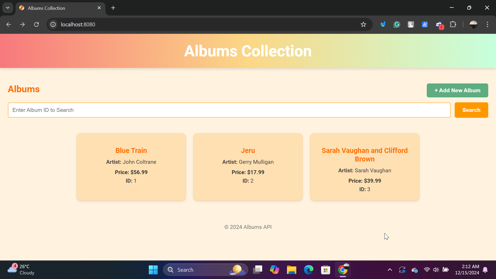
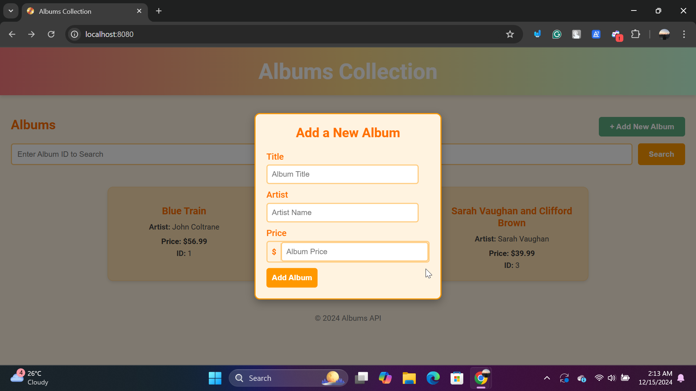

# RESTful web service API using Go and the Gin

## ⭐ Project Overview
This project demonstrates building a RESTful web service API using Go and the Gin Web Framework. It was developed as part of the **Pemrograman Berbasis Kerangka Kerja (D)** course and is inspired by the [official Go tutorial](https://go.dev/doc/tutorial/web-service-gin). The application showcases CRUD functionality for managing album records, providing a simple interface to interact with a dataset.

## ⭐ How to Set Up and Run the Project

### 1. Install Go
   - Download and install the latest version of Go from the official site: [https://go.dev/dl/](https://go.dev/dl/).

### 2. Install the Gin Module
   - Use the following command to install the Gin framework:
     ```bash
     go get github.com/gin-gonic/gin
     ```

### 3. Navigate to the Project Directory
   - Change to the project folder:
     ```bash
     cd Go-Web-Application/web-service-gin
     ```

### 4. Start the Application
   - Run the application using:
     ```bash
     go run main.go
     ```
   - This will start the server, and you should see:
     ```
     Starting server on http://localhost:8080
     ```

## ⭐ Features Screenshots and Application Flow

### 1. Initial View
   - When you access [http://localhost:8080](http://localhost:8080), you'll see the home page displaying a list of 3 default albums loaded from the backend.
     

### 2. Adding a New Album
   - Click the **+ Add New Album** button to open a form popup.
     

   - Fill in the form fields (e.g., Title, Artist, and Price) and submit.
     

   - A confirmation popup will appear, and the new album will be displayed in the list.
     

## ⭐ Code Flow Explanation

### 1. Backend (Go)

#### **Router Setup**
- The Gin router is used to define routes for the application, including:
  - `GET /albums` - Fetch all albums.
  - `POST /albums` - Add a new album.

#### **Album Data**
- The `album` struct defines the album model with fields for ID, Title, Artist, and Price.
- A slice of albums is used to store the data in memory.

### 2. Frontend (HTML/JavaScript)

#### **HTML**
- The frontend includes an album list, a button for adding albums, and a dynamic form popup.

#### **JavaScript**
- Fetching albums:
  - The `fetchAlbums` function fetches data from the backend and updates the album list dynamically.

- Adding albums:
  - The `addAlbum` function sends a `POST` request to add a new album.

## ⭐ Conclusion
This project serves as a basic example of building RESTful APIs with Go and Gin. It demonstrates how to implement simple data retrieval and addition functionalities, connect the frontend with a backend API, and handle user interactions effectively. Future enhancements could include implementing update and delete features, database integration, and more complex functionalities.
