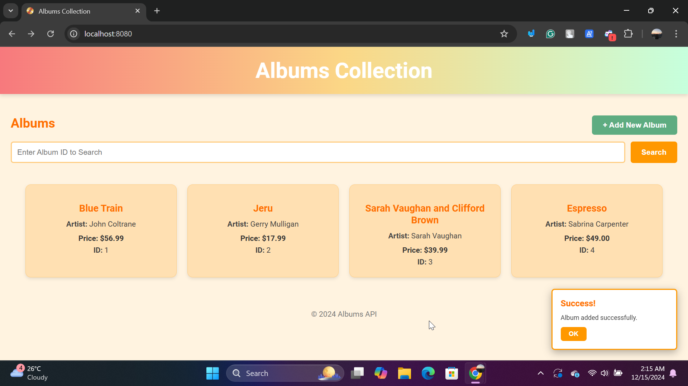

# RESTful Web Service API using Go and the Gin Framework

## ⭐ Project Overview
This project demonstrates the development of a RESTful web service API using Go and the Gin Web Framework. Built as part of the **Pemrograman Berbasis Kerangka Kerja (D)** course, the project is inspired by the [official Go tutorial](https://go.dev/doc/tutorial/web-service-gin). It provides a simple interface for managing album records, including features like viewing, adding, and searching for albums by ID.

## ⭐ How to Set Up and Run the Project

### 1. Install Go
   - Download and install the latest version of Go from the official website: [https://go.dev/dl/](https://go.dev/dl/).

### 2. Install the Gin Module
   - Install the Gin framework by running the following command:
     ```bash
     go get github.com/gin-gonic/gin
     ```

### 3. Navigate to the Project Directory
   - Change to the project folder:
     ```bash
     cd Go-Web-Application/web-service-gin
     ```

### 4. Start the Application
   - Start the server by running:
     ```bash
     go run main.go
     ```
   - If successful, the server will start, and you should see:
     ```
     Starting server on http://localhost:8080
     ```

## ⭐ Features and Application Flow

### 1. Initial View
   - Access the application by visiting [http://localhost:8080](http://localhost:8080).
   - The home page displays a list of 3 default albums loaded from the backend.
     

### 2. Adding a New Album
   - To add a new album, click the **+ Add New Album** button to open a popup form.
     

   - Fill in the form fields, such as the album's Title, Artist, and Price, then click the **Submit** button.
     

   - A confirmation popup will notify you of a successful addition, and the album will appear in the list.
     

### 3. Searching for an Album by ID
   - You can search for an album by entering its ID in the search field and pressing the **Search** button or the **Enter** key.
     

   - If the album is found, it will be displayed as a card.
     

   - If the album ID does not exist, a "Not Found" popup will appear in the bottom-right corner.
     

   - To return to the full album list, click on the header, which acts as a link to the home page.
     
     

## ⭐ Code Flow Explanation

### 1. Backend (Go)

#### **Router Setup**
- The Gin router defines the following API routes:
  - `GET /albums` - Retrieve a list of all albums.
  - `POST /albums` - Add a new album.
  - `GET /albums/:id` - Fetch details of a specific album by its ID.

#### **Album Data**
- The `album` struct models the album data with fields for:
  - `ID` - Unique identifier.
  - `Title` - Album title.
  - `Artist` - Name of the artist.
  - `Price` - Price of the album.
- A slice of `album` structs is used to store data in memory for this project.

### 2. Frontend (HTML/JavaScript)

#### **HTML**
- The frontend provides:
  - A dynamic album list displayed as responsive cards.
  - A form popup for adding new albums.
  - A search bar for retrieving albums by ID.

#### **JavaScript**
- **Fetching Albums**:
  - The `fetchAlbums` function retrieves all albums from the backend and displays them dynamically as cards.
- **Adding Albums**:
  - The `addAlbum` function sends a `POST` request to the backend to add a new album. The list updates automatically after a successful addition.
- **Searching Albums**:
  - The `searchAlbum` function allows users to search for an album by ID. If found, the album is displayed as a card. Otherwise, a popup notifies the user that the album ID was not found.

## ⭐ Conclusion
This project serves as a basic example of building RESTful APIs with Go and Gin. It demonstrates key concepts such as retrieving, adding, and searching for data, while connecting the frontend with a backend API. 